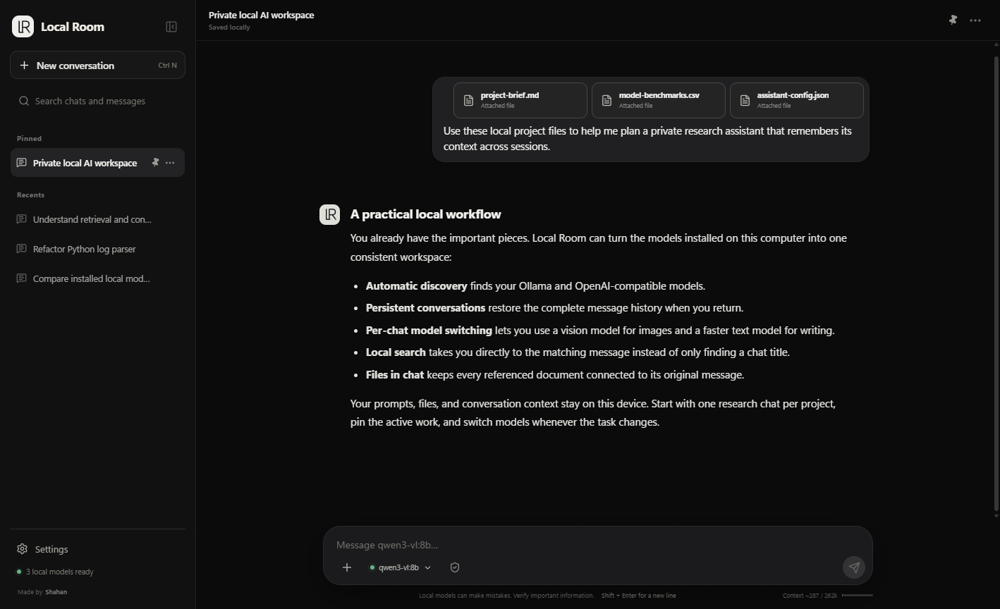
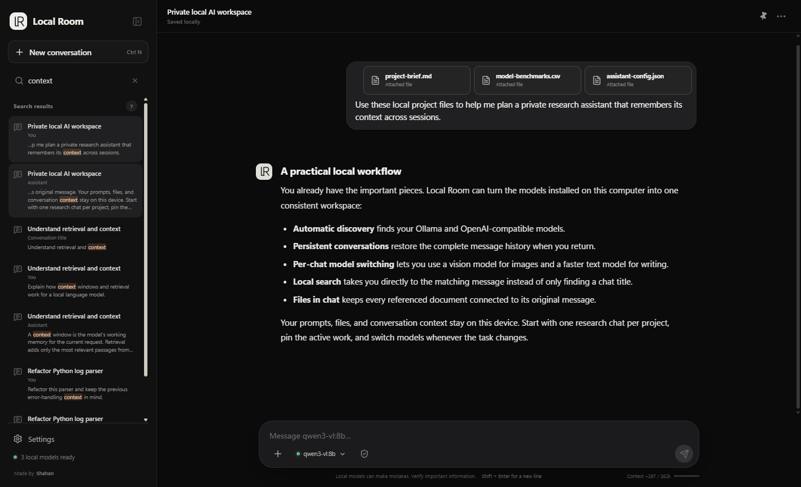
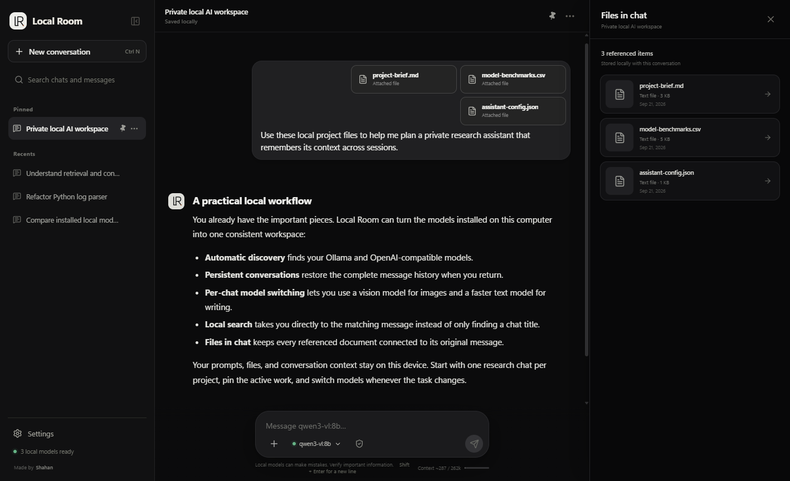

<div align="center">
  
  <h1>Local Room</h1>
  <p><strong>A private desktop chat workspace for the local AI models already running on your computer.</strong></p>
  <p>Keep conversations, restore context, switch models, search every message, and work with images or files—without turning your local LLM into a cloud service.</p>
  <p>
    <a href="#why-local-room">Why Local Room?</a> ·
    <a href="#features">Features</a> ·
    <a href="#supported-runtimes">Supported runtimes</a> ·
    <a href="#getting-started">Getting started</a>
  </p>
</div>



## Why Local Room?

Running a local model from Command Prompt or a terminal is wonderfully private, but it is not a great long-term workspace. Once the terminal closes, old conversations are difficult to revisit, separate projects blur together, and continuing with the right context becomes manual work.

Local Room gives those same local models a polished desktop chat interface:

- Conversations are saved and organized automatically.
- Returning to a chat restores its previous messages and context.
- Every conversation remembers which runtime and model it uses.
- Installed models exposed by a running local server are detected automatically.
- Everything is designed around local endpoints and on-device storage.

It feels like a modern hosted chatbot, while the model inference and conversation data remain on your computer.

## Features

| Feature | What it does |
| --- | --- |
| **Automatic model discovery** | Detects available models from Ollama, LM Studio, LocalAI, llama.cpp, and other enabled OpenAI-compatible localhost servers. |
| **Persistent conversations** | Saves independent chat histories and restores them across app restarts and conversation switching. |
| **Context continuity** | Sends the relevant saved conversation back to the selected local model, with context-window-aware trimming for long chats. |
| **Message-level search** | Searches titles, user messages, assistant responses, and attachment names. Selecting a result jumps to the exact message. |
| **In-chat model switching** | Changes the model from the composer without leaving the current conversation. |
| **Capability-aware attachments** | Shows image controls for vision-capable models and supports text, code, CSV, JSON, and pasted images. |
| **Files in chat** | Collects referenced files in a side panel and links each item back to its original message. |
| **Conversation tools** | Pin, rename, delete, share, export to Markdown, edit a prompt, retry a response, or branch from an earlier message. |
| **Local backup and restore** | Exports or restores conversations, settings, and configured local runtimes as a portable JSON backup. |
| **Responsive streaming** | Streams responses, reports response speed, supports reliable cancellation, and stops auto-scrolling when you scroll up to read. |
| **Desktop controls** | Resizable side panels, collapsible navigation, and interface zoom using `Ctrl +`, `Ctrl -`, and `Ctrl 0`. |

## See it in action

### Search inside the conversation—not only its title

Search results include surrounding message text and highlight the matching phrase. Click any result to open the correct chat and scroll directly to that message.



### Keep every referenced file connected to its message

The Files in chat panel lists images and documents used in a conversation. Selecting an item returns to the exact place where it was attached.



## Supported runtimes

Local Room includes default detection for:

- [Ollama](https://ollama.com/) at `http://127.0.0.1:11434`
- [LM Studio](https://lmstudio.ai/) at `http://127.0.0.1:1234/v1`
- LocalAI or a llama.cpp server at `http://127.0.0.1:8080/v1`
- Additional OpenAI-compatible servers configured on `localhost`, `127.0.0.1`, or `::1`

The runtime needs to be running before its models can be detected. Local Room intentionally rejects non-local server addresses.

## Getting started

### Windows installer

Download the newest installer from the [GitHub Releases page](https://github.com/shxhxn/LocalRoom/releases), run it, and open **Local Room** from the Start menu.

Then:

1. Start Ollama, LM Studio, or another supported local model server.
2. Open Local Room. It scans the enabled local runtimes automatically.
3. Choose a detected model from the composer and start chatting.

If a custom localhost server is not discovered automatically, add its OpenAI-compatible endpoint under **Settings → Local servers**.

### Build from source

Requirements:

- Windows 10 or 11
- [Node.js](https://nodejs.org/) 20 or newer
- A running supported local model server

```powershell
git clone https://github.com/shxhxn/LocalRoom.git
cd LocalRoom
npm install
npm run dev
```

Build the production application:

```powershell
npm run build
npm start
```

Create a Windows installer:

```powershell
npm run dist
```

The generated installer is written to `release/`.

## How context is retained

Each conversation stores its messages, selected runtime, selected model, attachments, and timestamps locally. When you continue that conversation, Local Room rebuilds the request from its saved messages and sends it to the local model server. If the model reports a context limit, the oldest request messages are omitted as needed while the complete saved conversation remains unchanged.

## Privacy and storage

- Conversation data is stored in Electron's private application-data directory as `local-room-data.json`.
- Prompts and attachments are sent only to the localhost model runtime you selected.
- There are no accounts, analytics, cloud APIs, or remote fonts in the application.
- Image and text attachments are stored with the local conversation so they remain available after restarting.
- Full backups can be created from Settings at any time.

## Keyboard shortcuts

| Shortcut | Action |
| --- | --- |
| `Ctrl + N` | Start a new conversation |
| `Ctrl + F` | Search chats and messages |
| `Escape` | Close menus or clear a focused search |
| `Enter` | Send a message |
| `Shift + Enter` | Insert a new line |
| `Ctrl +` / `Ctrl -` | Zoom the interface in or out |
| `Ctrl + 0` | Reset interface zoom |

## Development checks

```powershell
npm run typecheck
npm run build
npm run smoke
```

The smoke test checks live local-model discovery, context metadata, and request cancellation against Ollama when it is available.

## License

Local Room is open-source software licensed under the [MIT License](LICENSE).

## Creator

Designed and developed by **Shahan Samar**.

- [LinkedIn](https://www.linkedin.com/in/shahan-samar-603063371/)
- [GitHub](https://github.com/shxhxn)
